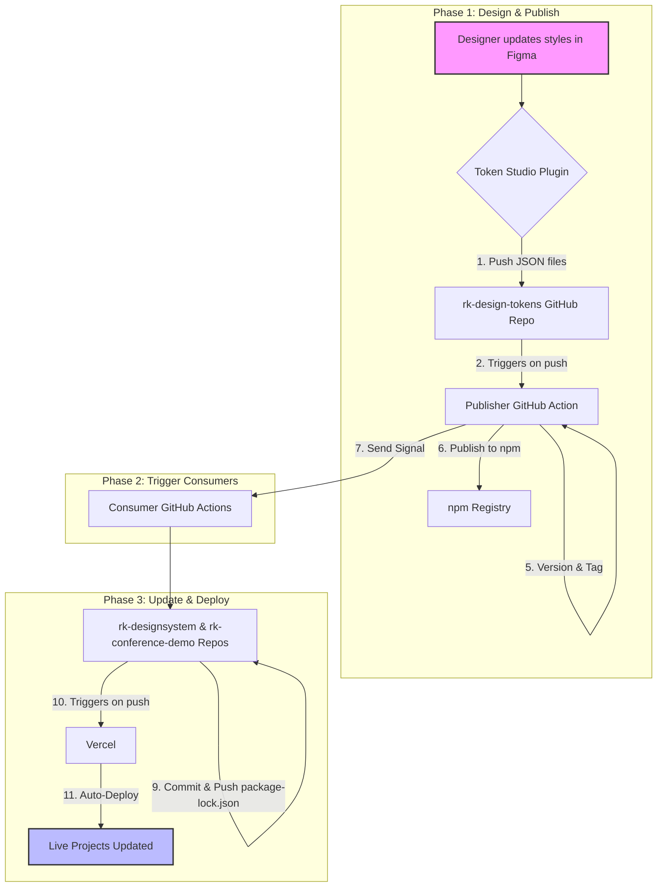

# Røde Kors Design Tokens

This repository is the central source for all design tokens (colors, typography, spacing, etc.) for the Norwegian Red Cross's digital products. It acts as a single source of truth that automatically distributes style changes to all connected projects.

---

## How to Use These Tokens

This package can be used in different ways depending on the component library you are working with.

---

### Using with Røde Kors Designsystem (`@digdir/designsystemet`)

This is the primary way to use the tokens for official Røde Kors projects built with the React component library.

#### 1. Installation

You'll need three packages: the component library (`rk-designsystem`), the base styles from Digdir, and this theme package (`rk-design-tokens`).

```bash
npm install rk-designsystem @digdir/designsystemet-css rk-design-tokens
```

#### 2. Import CSS

In your application's root layout file (e.g., `layout.tsx`), import the base stylesheet before the Røde Kors theme file. This order is crucial.

**TypeScript**

```typescript
// src/app/layout.tsx (or equivalent)

import '@digdir/designsystemet-css/index.css';         // 1. Base component styles
import 'rk-design-tokens/design-tokens-build/brand-1.css'; // 2. Røde Kors theme override

export default function RootLayout({ children }) {
  return (
    <html lang="no">
      <body>{children}</body>
    </html>
  );
}
```

### Using with Bootstrap (Sass)

This package provides a dedicated Sass file to fully theme the Bootstrap framework, including support for light and dark modes.

#### 1. Installation

In addition to this package, your project must also have `bootstrap` and `sass` installed.

```bash
npm install bootstrap sass
```

#### 2. Import Sass Theme

In your project's main Sass file (e.g., `globals.scss`), import the Røde Kors theme file before the main Bootstrap library.

```scss
// 1. Import the Røde Kors theme file for Bootstrap.
// This contains all the necessary variable overrides.
@import "rk-design-tokens/design-tokens-build/bootstrap-theme.scss";

// 2. Import the main Bootstrap library.
// Bootstrap will now compile using your custom theme.
@import "bootstrap/scss/bootstrap";
```

#### 3. Enable Theme Switching

To switch between light and dark modes, apply the `data-bs-theme` attribute to a parent element (like `<html>`). You can toggle this value with JavaScript.

**TypeScript**

```typescript
// Example in a Next.js layout.tsx

// Sets the default theme to "light"
export default function RootLayout({ children }) {
  return (
    <html lang="no" data-bs-theme="light">
      <body>{children}</body>
    </html>
  );
}
```

### Using with shadcn/ui (Tailwind + shadcn)

This section explains two common ways to use `rk-design-tokens` together with `shadcn/ui` (which uses Tailwind CSS and Radix): (A) import the generated CSS variables directly, or (B) map tokens into Tailwind’s theme so utility classes can reference them.

Pick the approach that fits your project.

#### A) Import `rk-design-tokens` CSS (fast, minimal)

1.  **Installation**

    ```bash
    npm install rk-design-tokens
    ```

2.  Import token CSS in your global stylesheet or root layout before your app styles so the CSS variables and theme overrides are available to shadcn components.

    **Example (Next.js app directory — `src/app/layout.tsx`):**

    ```typescript
    // src/app/layout.tsx (or equivalent)

    import 'rk-design-tokens/design-tokens-build/shadcn-theme.css'; // import tokens first
    import './globals.css'; // your Tailwind/shadcn global CSS

    export default function RootLayout({ children }) {
      return (
        <html lang="no">
          <body>{children}</body>
        </html>
      );
    }
    ```

3.  **Usage**

    *   shadcn components will pick up colors and variables defined in the imported CSS (via CSS variables). Use Tailwind utility classes as usual and override styles with the CSS variables if needed (see approach B for mapping into Tailwind utilities).

    *   For theme switching (light/dark), the token CSS supports data attributes — apply e.g. `<html data-theme="light">` or `<html data-theme="dark">` depending on the token build (or use `data-bs-theme` if you are using that approach). Confirm the token CSS file you imported supports the attribute you toggle.

#### B) Map tokens into Tailwind (recommended for full Tailwind utility support)

1.  **Installation**

    ```bash
    npm install rk-design-tokens
    ```

2.  Import tokens CSS (to expose CSS variables) and configure Tailwind to read CSS variables for colors and other tokens.

    *   Import token CSS in your global CSS so the variables exist at runtime:

        ```css
        /* src/styles/globals.css */
        @import "rk-design-tokens/design-tokens-build/shadcn-theme.css";
        
        /* Tailwind base */
        @tailwind base;
        @tailwind components;
        @tailwind utilities;
        ```

    *   In `tailwind.config.js` map your theme values to the CSS variables exported by the tokens. Many token sets expose variables like `--rk-color-primary`, `--rk-foreground`, etc. Use the `rgb/var` pattern to preserve Tailwind alpha utilities:

        ```javascript
        // tailwind.config.js
        module.exports = {
          content: [
            './src/**/*.{js,ts,jsx,tsx}',
            // shadcn/ui components locations if applicable
          ],
          theme: {
            extend: {
              colors: {
                primary: {
                  DEFAULT: 'rgb(var(--rk-color-primary) / <alpha-value>)',
                  foreground: 'rgb(var(--rk-color-on-primary) / <alpha-value>)',
                },
                background: 'rgb(var(--rk-color-background) / <alpha-value>)',
                // add other tokens you need
              },
              // Map typography, radius, spacing similarly if tokens expose variables
              borderRadius: {
                lg: 'var(--rk-radius-lg)',
              },
            },
          },
          plugins: [
            require('@tailwindcss/forms'),
            // other plugins
          ],
        };
        ```

3.  **Usage**

    *   Now standard Tailwind classes work with your design tokens:
        *   `bg-primary`, `text-primary-foreground`, `ring-primary/50`, etc.

    *   shadcn components (which are Tailwind-based) will use these variables when you apply Tailwind utilities or when you customize component props/classes.

#### Notes and tips

*   **Verify variable names:** open the imported token CSS to confirm exact CSS variable names (e.g., `--rk-color-primary` or `--rk-token-color-primary`). Adjust `tailwind.config.js` accordingly.

*   **Dark mode:** If your token CSS supports data-attribute theme switching (e.g., `data-theme` or `data-bs-theme`), you can toggle the attribute on `<html>` or a parent to switch themes. If you use Tailwind’s class-based dark mode, combine approaches by ensuring the token CSS includes both light/dark variable definitions and toggling the same attribute/class you use for dark in Tailwind. Example:
    *   Use attribute: `<html data-theme="dark">` and ensure token CSS maps the variables for that attribute.
    *   Or import a token CSS that exposes dark variables under `.dark` (less common).

*   **Server-side rendering:** For Next.js, ensure the token CSS import is included in your `app/layout` so variables are present on first paint to avoid FOUC.

*   **Customizing shadcn components:** You can pass Tailwind classes that reference mapped token colors or create component-level CSS that uses the token CSS variables directly (e.g., `color: var(--rk-color-primary)`).

#### Example minimal Next.js + shadcn setup

1.  **Install packages:**

    ```bash
    npm install rk-design-tokens tailwindcss postcss autoprefixer
    ```

2.  Configure Tailwind as shown above and import token CSS in `globals`.

3.  Use shadcn components and apply classes like `bg-primary text-primary-foreground`.

This gives you flexibility: use the token CSS directly for global theming (approach A), or map tokens into Tailwind for rich utility support and smooth integration with shadcn (approach B). Choose whichever fits your workflow best.

### End-to-End Design Token Automation Workflow

#### Brief Explanation

This workflow establishes a fully automated pipeline that connects our design process directly to our live production applications. When a designer updates the brand style in Figma, this system automatically builds, versions, and publishes a new style package to npm. It then signals our Vercel projects, which automatically update themselves and redeploy with the new styles.

#### Flowchart



#### The Process in Detail

##### Phase 1: A Designer Makes a Change (The "Publisher")

This phase occurs within the `rk-design-tokens` repository.

*   **Design in Figma:** A designer makes a change to a color, font, or any other design token.
*   **Push to GitHub:** Using the Token Studio plugin, the designer pushes the changes. This automatically commits the updated JSON files to the main branch.
*   **Trigger the Publisher Workflow:** This push instantly triggers the GitHub Action defined in `.github/workflows/publish.yml`.
*   **Build & Commit Artifacts:** The workflow runs `npm run build` to generate CSS from the JSON files and commits the results.
*   **Versioning & Release:** The workflow runs `npm version patch` to bump the version, create a release commit, and tag it.
*   **Publish to npm:** Finally, the workflow publishes the new version of the package to the npm registry.

##### Phase 2: Notifying the Applications (The "Signal")

*   **Send a Dispatch Signal:** After a successful publish, the workflow sends a `repository_dispatch` signal to consumer projects like `rk-designsystem` to notify them of the new version.

##### Phase 3: Automatic Update and Redeployment (The "Consumers")

This phase runs in parallel for consumer projects.

*   **Trigger the Consumer Workflow:** The dispatch signal starts an "Update" workflow in the consumer projects.
*   **Update Dependencies:** The workflow runs `npm update rk-design-tokens` to fetch the latest version.
*   **Commit & Push the Update:** The workflow commits the updated `package-lock.json` file.
*   **Vercel Auto-Deploys:** Vercel's Git integration detects the new commit and automatically starts a new deployment.

Within minutes of the designer pushing a change in Figma, all live websites are updated with the new styles, completing the fully automated, end-to-end cycle.