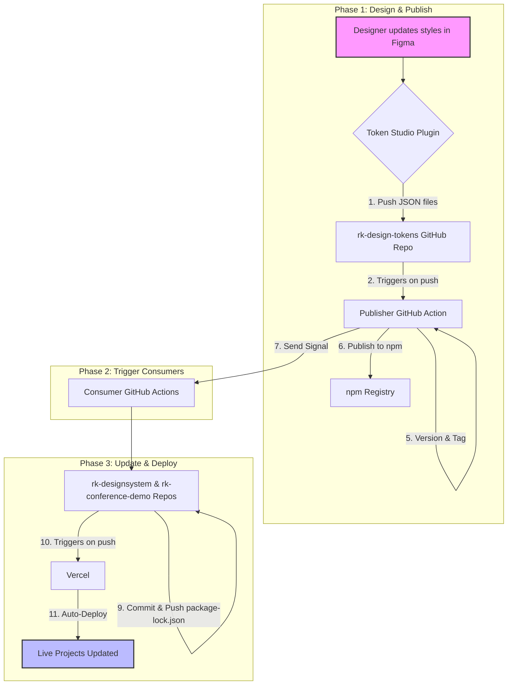

# Røde Kors Design Tokens

This repository is the central source for all design tokens (colors, typography, spacing, etc.) for the Norwegian Red Cross's digital products. It acts as a single source of truth that automatically distributes style changes to all connected projects.

---

## How to Use These Tokens

This package can be used in different ways depending on the component library you are working with.

---

### Using with Røde Kors Designsystem (`@digdir/designsystemet`)

This is the primary way to use the tokens for official Røde Kors projects built with the React component library.

#### 1. Installation

You'll need three packages: the component library (`rk-designsystem`), the base styles from Digdir, and this theme package (`rk-design-tokens`).

```bash
npm install rk-designsystem @digdir/designsystemet-css rk-design-tokens
```

#### 2. Import CSS

In your application's root layout file (e.g., layout.tsx), import the base stylesheet before the Røde Kors theme file. This order is crucial.

TypeScript

```ts
// src/app/layout.tsx (or equivalent)

import '@digdir/designsystemet-css/index.css';         // 1. Base component styles
import 'rk-design-tokens/design-tokens-build/brand-1.css'; // 2. Røde Kors theme override

export default function RootLayout({ children }) {
  return (
    <html lang="no">
      <body>{children}</body>
    </html>
  );
}
```

### Using with Bootstrap (Sass)
This package provides a dedicated Sass file to fully theme the Bootstrap framework, including support for light and dark modes.

#### 1. Installation
In addition to this package, your project must also have bootstrap and sass installed.

```bash
npm install bootstrap sass
```

#### 2. Import Sass Theme
In your project's main Sass file (e.g., globals.scss), import the Røde Kors theme file before the main Bootstrap library.

```scss
// 1. Import the Røde Kors theme file for Bootstrap.
// This contains all the necessary variable overrides.
@import "rk-design-tokens/design-tokens-build/bootstrap-brand-1.scss";

// 2. Import the main Bootstrap library.
// Bootstrap will now compile using your custom theme.
@import "bootstrap/scss/bootstrap";
```

#### 3. Enable Theme Switching
To switch between light and dark modes, apply the data-bs-theme attribute to a parent element (like `<html>`). You can toggle this value with JavaScript.

TypeScript

```ts
// Example in a Next.js layout.tsx

// Sets the default theme to "light"
export default function RootLayout({ children }) {
  return (
    <html lang="no" data-bs-theme="light">
      <body>{children}</body>
    </html>
  );
}
```

## End-to-End Design Token Automation Workflow

### Brief Explanation
This workflow establishes a fully automated pipeline that connects our design process directly to our live production applications. When a designer updates the brand style in Figma, this system automatically builds, versions, and publishes a new style package to npm. It then signals our Vercel projects, which automatically update themselves and redeploy with the new styles.

### Flowchart
Code snippet



### The Process in Detail

#### Phase 1: A Designer Makes a Change (The "Publisher")
This phase occurs within the rk-design-tokens repository.

Design in Figma: A designer makes a change to a color, font, or any other design token.

Push to GitHub: Using the Token Studio plugin, the designer pushes the changes. This automatically commits the updated JSON files to the main branch.

Trigger the Publisher Workflow: This push instantly triggers the GitHub Action defined in .github/workflows/publish.yml.

Build & Commit Artifacts: The workflow runs npm run build to generate CSS from the JSON files and commits the results.

Versioning & Release: The workflow runs npm version patch to bump the version, create a release commit, and tag it.

Publish to npm: Finally, the workflow publishes the new version of the package to the npm registry.

#### Phase 2: Notifying the Applications (The "Signal")
Send a Dispatch Signal: After a successful publish, the workflow sends a repository_dispatch signal to consumer projects like rk-designsystem to notify them of the new version.

#### Phase 3: Automatic Update and Redeployment (The "Consumers")
This phase runs in parallel for consumer projects.

Trigger the Consumer Workflow: The dispatch signal starts an "Update" workflow in the consumer projects.

Update Dependencies: The workflow runs npm update rk-design-tokens to fetch the latest version.

Commit & Push the Update: The workflow commits the updated package-lock.json file.

Vercel Auto-Deploys: Vercel's Git integration detects the new commit and automatically starts a new deployment.

Within minutes of the designer pushing a change in Figma, all live websites are updated with the new styles, completing the fully automated, end-to-end cycle.